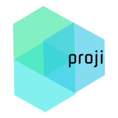
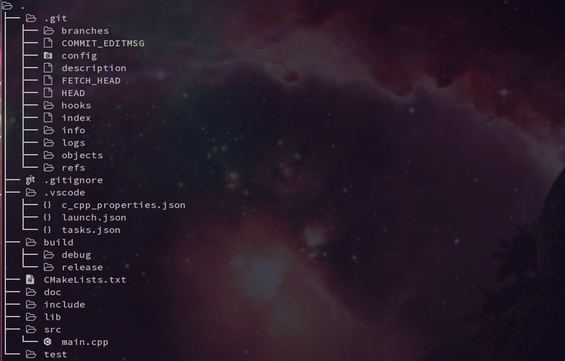
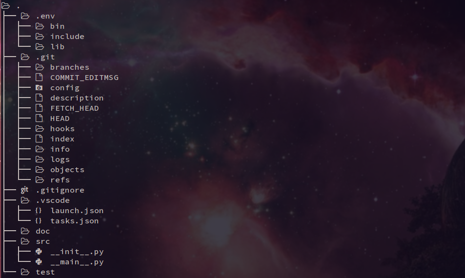

<p align="center">
  <a href="" rel="noopener">
 </a>
</p>

<!--<h3 align="center">proji</h3>-->

<div align="center">


[](/LICENSE)
[](https://www.codacy.com/manual/nikoksr/proji?utm_source=github.com&utm_medium=referral&utm_content=nikoksr/proji&utm_campaign=Badge_Grade)
[](https://goreportcard.com/report/github.com/nikoksr/proji)
[](https://circleci.com/gh/nikoksr/proji/tree/master)

</div>

---

<p align="center">Proji is a simple and fast project creator and manager.
    <br>
</p>

## Table Of Contents

- [About](#about)
- [Getting Started](#getting_started)
- [Dependencies](#dependencies)
- [Installation](#installation)
- [Tests](#tests)
- [Usage](#usage)

## About <a name = "about"></a>

I always liked to have orderly project structures but it is so annoying to create all those folders and files each time I want to start a new project. It's so much redundant work that costs me a lot of time. This is why I created proji. Proji automates all of those tasks for you based on templates, configs and scripts you created once.

## Getting Started <a name = "getting_started"></a>

Proji is currently supported only for linux. You can either download a precompiled binary from the latest [release](https://github.com/nikoksr/proji/releases) or install it from source.

### Dependencies <a name = "dependencies"></a>

- [go](https://golang.org/) - Main language
- [sqlite3](https://www.sqlite.org/index.html) - Database
- [mattn/go-sqlite3](https://github.com/mattn/go-sqlite3) - Go Sqlite3 Driver
- [spf13/cobra](https://github.com/spf13/cobra) - CLI commands
- [spf13/viper](https://github.com/spf13/viper) - Manage config file
- [BurntSushi/toml](https://github.com/BurntSushi/toml) - Go toml parser
- [toml-lang/toml](https://github.com/toml-lang/toml) - Config Language
- [jedib0t/go-pretty](https://github.com/jedib0t/go-pretty) - CLI Styling
- [stretchr/testify](github.com/stretchr/testify) - Test Framework

### Installation <a name = "installation"></a>

#### Binary Distributions

1. Download the latest [release](https://github.com/nikoksr/proji/releases) for your system
2. Extract the tar with: `$ tar -xf proji-XXXX-XXX.tar.gz`
3. Run the installer: `$ ./install.sh`

#### Install From Source

1. `$ go get -u github.com/nikoksr/proji`
2. `$ go install ./cmd/proji/` or `go build -o proji ./cmd/proji`
3. `$ ./install.sh`

_Hint:_ Test your installation by executing `$ proji`. On success the help text for proji will be printed.

### Running The Tests <a name = "tests"></a>

- `$ go vet ./...`
- `$ go test -v ./...`

## Usage <a name="usage"></a>

Let's suppose I want to create a c++ project. Normally, I'd have to execute several commands to create various folders and files, to initialize git, setup cmake etc. But since I always want to use the same structure and tools for my C++ apps, this process can be very well automated.

With proji all I have to do is run a single command:

```

$ proji create cpp MyProjectName

```

Which results in a project structure like this:



Now if I'd want to create a python project:

```

$ proji create py MyPythonProject

```

Which results in a project structure like this:



As you can see the two results differ from another. The project relevant folder structure is different and some files are different too.

In the cpp example proji created a cpp specific `.vscode` folder which sets up the debugger in my editor of choice - `vscode`. Proji created a basic project specific `CMakeLists.txt` which enables me to build a debug or release version of my project with `cmake`.

In the python example proji setup a running `virtuelenv` with all packages of my choice already installed. The `.vscode` folder now contains python specific config files.

In both examples proji created barebone main-files, initialized `git` and checked out the `develop branch`.
