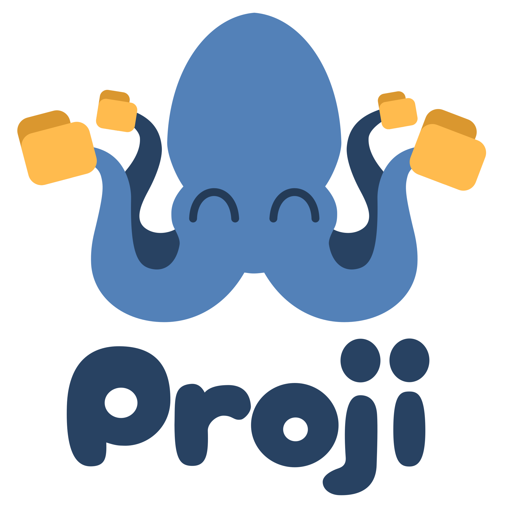
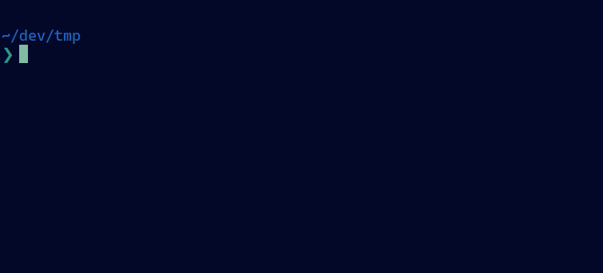
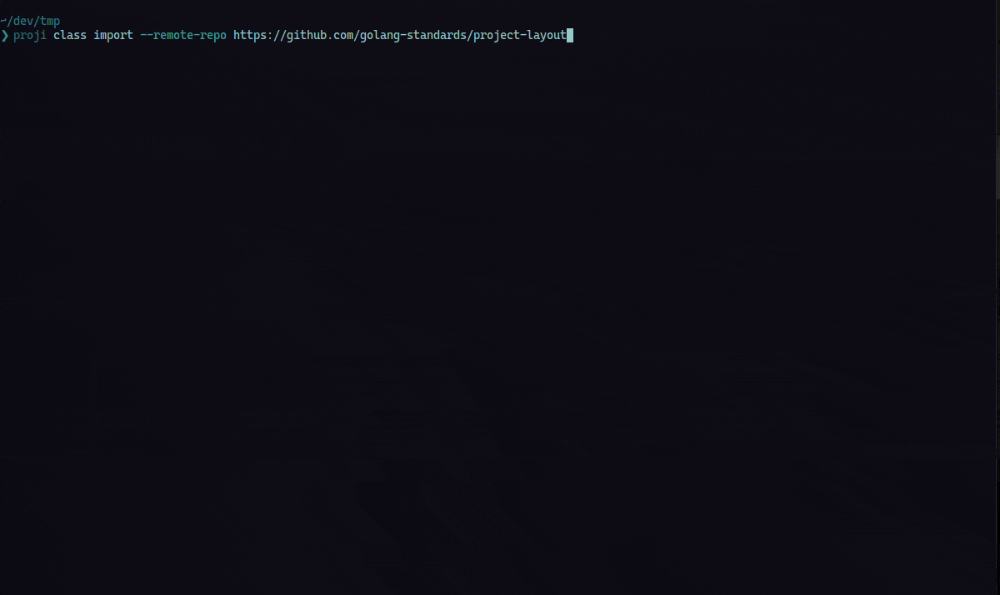
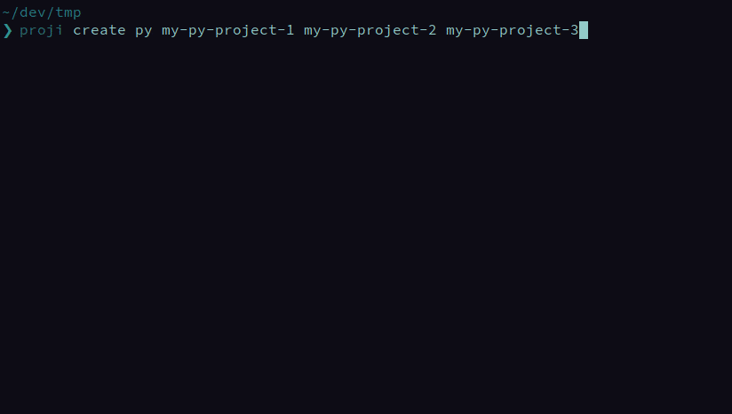

> Note: I haven't had much time to work on proji lately due to my job and the current worldwide situation. I will continue to work on proji soon. Stay safe, everyone!

  <a href="#demo">Demo</a>
  ·
  <a href="#installation">Installation</a>
  ·
  <a href="#basic_usage">Basic Usage</a>
  ·
  <a href="https://github.com/nikoksr/proji-examples">Example configs</a>

A powerful cross-platform CLI project templating tool.

 

    

 

## Key Features

-   Creates project directories of any size **in seconds**
-   Project templates are based on **individual config files**
-   Structures of **GitHub/GitLab repos can be imported** as templates
-   Structures of **directories can be imported** as templates
-   Infinitely extendable through integration of **custom shell scripts**
-   Supports **custom template files**
-   **Shareable** project configs
-   Projects are **not bound to any language or framework**
-   Boosts your **productivity** and simplifies your **workflow**
-   Works on **Windows**, **macOS** and **Linux**

## Demo 

Quick comparison between proji and a common way of project creation. In the demo we create a python project which consists of three folders and two files. We create a `virtualenv`, install three python packages, initialize the project as a `git repo` and finally make the first commit and add a develop branch.

<strong>Proji:</strong>

    

<strong>Common Way:</strong>

    

 

As you can see proji would have saved you about **1:15 minutes and 230 keystrokes**. Note that in this example only a very small project is created. The advantages of proji increase exponentially with increasing project complexity.

<h1></h1>
 

<strong>Import a remote repository:</strong>

    

You can easily import the structure of your favorite projects from [GitHub](https://github.com) and [GitLab](https://gitlab.com) as proji packages.

## Getting Started 

Proji is **cross-platform** and runs on Linux, MacOS and Windows.

### Installation 

> **Important:** After the installation process has successfully completed, you must run 'proji init' once.
> This initializes proji's main configuration folder and is mandatory.

#### Binary 

Install the correct binary for your operating system and architecture in `./bin` with a single command:

    curl -sfL https://git.io/proji | sh

Afterwards, move the executable to a folder that's in your path.

#### Package 

##### Arch Linux (AUR) 

    yay -S proji

or

    yay -S proji-bin

##### MacOS 

    brew install nikoksr/taps/proji

##### Windows 

    scoop bucket add nikoksr https://github.com/nikoksr/scoop-bucket

    scoop install proji

#### From Source 

> **Note:** The `master` branch may be in an _unstable or even broken state_ during development. Please use [releases](https://github.com/nikoksr/proji/releases) instead of the `master` branch in order to get stable binaries.

    go get -u github.com/nikoksr/proji

    cd $GOPATH/src/github.com/nikoksr/proji

    go install .

<h1></h1>

Validate the success of your installation by executing `proji version`.

### Running the Tests 

    go vet ./...
    go test -v ./...

> **Note:** Export the environment variable `PROJI_SKIP_NETWORK_TESTS=1` if you want to skip internet-dependent tests.

### Tab Completion 

Proji does support tab completion under bash and zsh but at the moment you have to set it up yourself. The following instructions were inspired by [kubernetes completion](https://kubernetes.io/docs/tasks/tools/install-kubectl/#enabling-shell-autocompletion).

#### Bash

For tab-completion under bash you first need to install and enable [bash_completion](https://github.com/scop/bash-completion#installation).

You now need to ensure that the proji completion script gets sourced in all your shell sessions.

    # Create the completion file
    proji completion bash > $HOME/.config/proji/completion.bash.inc

    # Make your bash_profile source it
    printf "
      # Proji shell completion
      source '$HOME/.config/proji/completion.bash.inc'
      " >> $HOME/.bash_profile

    # Source it once for immediate completion
    source $HOME/.bash_profile

#### Zsh

This command will create a zsh completion file in your current users default zsh completion folder:

    proji completion zsh > "${fpath[1]}/_proji"

## Basic Usage 

Suppose I create python projects on a regular basis and want to have the same directory structure for each of these projects. I would therefore have to execute every command necessary to create the appropriate directories and files and would then have to run tools like git and virtualenv to fully get my usual development environment up and running.

That would not be too bad if you only create a new project every few weeks or months. However, if you want to create new projects more regularly, be it to test something quickly, learn something new, or quickly create an environment to reproduce and potentially solve a problem found on stackoverflow, then this process quickly becomes very tiring.

### Setting up a Package 

To solve this problem with proji, we first have to create a so-called package. A package in proji defines the structure and behavior for projects of a particular topic (python in this example). It serves as a template through which proji will create new projects for you in the future. This package will determine which directories and files we always want to get created by proji and which scripts proji should execute. For example a script which automatically initializes git in the project, creates a develop branch and makes a first commit.

Note that folders and files can either be created new and empty or be copied from a so-called template. In the config folder you can find the template folder (`~/.config/proji/templates/`) in which you can store folders and files that you want to use as templates. In our example we could put a python file into this folder. The file could contain a very basic python script something like a 'hello world' program. We can tell proji to always copy this file into our newly created python projects. The same goes for folders. The goal of the templates is to save you even more time.

In addition, we can assign scripts to a proji package which will be executed in a desired and defined order. Scripts must be saved under `~/.config/proji/scripts/` and can then be referenced by name in the package config.

 

> A collection of example configs can be found [here.](https://github.com/nikoksr/proji-examples)

#### Structure of a Package

-   **Name:** A name that describes the topic of the package (e.g. `python`)
-   **Label:** A label that serves as an abbreviation for easily calling the package (e.g. `py`)
-   **Folders:** A list of folders to be created
-   **Files:** A list of files to be created
-   **Scripts:** A list of scripts to run after the project directory has been created

#### Create a Package

There are four ways to create a new package:

##### 1. Config file

Proji offers the possibility to export and import packages through config files. The easiest way to create a new package would be to export the proji sample config and then adapt it to your needs. To do so, execute the command `proji package export --template`.

Proji creates the file `proji-package-template.toml` in the current working directory. If you open this file in a text editor, you will find a richly annotated configuration of an example package. This config should then be adapted according to your needs.

Once the config has been edited and saved, it can be imported using the `proji package import --config proji-package-template.toml` (or whatever you named the file) command. Proji then creates a new package based on the imported config.

##### 2. Local directory

Proji can import the structure of a local directory as a package. It will analyze the directory and create a package config based on all sub-directories and files.

To do so, first create the config with `proji package import --directory path/to/dir`. Then edit the resulting config as needed in your editor of choice. For example, remove folders and files that you do not want to add to your package, or add files, folders, and scripts that are missing. When you are done, import the configuration as seen above with `proji package import --config proji-dir.toml`.

##### 3. Remote repository

Similar behaviour as the `directory` example but instead of importing the structure of a local directory you can import the structure of a remote repository. Currently tested and supported code hosting platforms are [github](https://github.com/) and [gitlab](https://gitlab.com).

As an example, let's create a package based on this repository. First, run the command `proji package import --remote-repo https://github.com/nikoksr/proji`. Similar to the `directory` flag this will export a package config based on the remote repository. You can then edit the config to your liking and needs and import it afterwards with `proji package import --config proji-proji.toml`.

##### 4. Package add command (not recommended)

The third option is to use the `proji package add CLASS-NAME [CLASS-NAME...]` command to create one or more packages in an interactive CLI. Proji will query the necessary data for the new package from you and then create the new package based on that data.

The advantage of the config file is that incorrect information can easily be corrected. For example, if you entered a script that does not exist or whose name was simply misspelled, you can easily change the name in the configuration file. This is not possible in the CLI menu. If the entry is incorrect, the creation process must be restarted.

<h1></h1>

After the package has been created or imported, we can use the command `proji package ls` to display a list of our available packages. The command `proji package show LABEL [LABEL...]` allows us to display a detailed view of one or more packages.

### Creating our first projects 

Now that we have created our python package in proji, we can use it to easily create new projects. A package is created once and is then reused by proji over and over again, and although the process of creating a package might initially seem a bit complex, you will very soon start saving a lot of time and keystrokes and will improve the general consistency of your projects structures.

Assuming our package has been assigned the label `py`, we will create three projects with the command `proji create py my-py-project-1 my-py-project-2 my-py-project-3`.

 

 

 

And voila, proji has created three new project directories where you can start your work immediately. The project directories are all built identically, have the same subdirectories and files, and all ran the same scripts.

Take a look at the [python package config](examples/proji-python.toml), the [git](examples/init_git.sh) and [virtualenv](examples/init_virtualenv.sh) scripts that were used in this example.

## Advanced Usage 

Help for all commands is also available with `proji help`.

### Package 

-   Add a package: `proji package add NAME`

-   Remove one or more packages: `proji package rm LABEL [LABEL...]`

-   Import one or more packages from configs: `proji package import --config FILE [--config FILE...]`

-   Import one or more packages from directories: `proji package import --directory DIR [--directory DIR...]`

-   Import one or more packages from remote repositories: `proji package import --remote-repo URL [--remote-repo URL...]`

-   Export one or more packages: `proji package export LABEL [LABEL...]`

-   List all packages: `proji package ls`

-   Show details of one or more packages: `proji package show LABEL [LABEL...]`

### Project 

-   Create one or more projects: `proji create LABEL NAME [NAME...]`

-   Add a project: `proji add LABEL PATH STATUS`

-   Remove one or more projects: `proji rm ID [ID...]`

-   Set new project path: `proji set path PATH PROJECT-ID`

-   Set new project status: `proji set status STATUS PROJECT-ID`

-   List all projects: `proji ls`

-   Clean up project database: `proji clean`

### Status 

-   Add one or more statuses: `proji status add STATUS [STATUS...]`

-   Remove one or more statuses: `proji status rm ID [ID...]`

-   List all statuses: `proji status ls`

## Contribute 

Contributions to the project are highly appreciated. Take a look at the [code of conduct](./CODE_OF_CONDUCT.md) and at the [contribution instructions](./CONTRIBUTING.md) and you should be good to go.

If you have any questions or need help with your contribution, please contact me at the address in my profile. I will gladly help you.

## Credits 

-   Logo by [Alex Potterson](mailto:alexeyrdoxi@gmail.com)

-   AUR Maintainer [Scrumplex](https://scrumplex.net/)

## License 

Proji is released under the MIT license. See [LICENSE](LICENSE)
